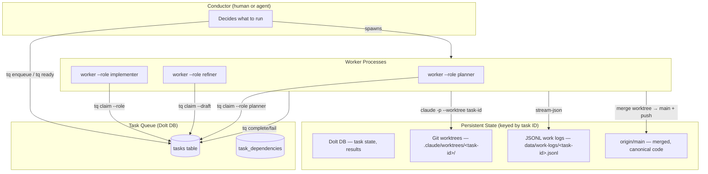
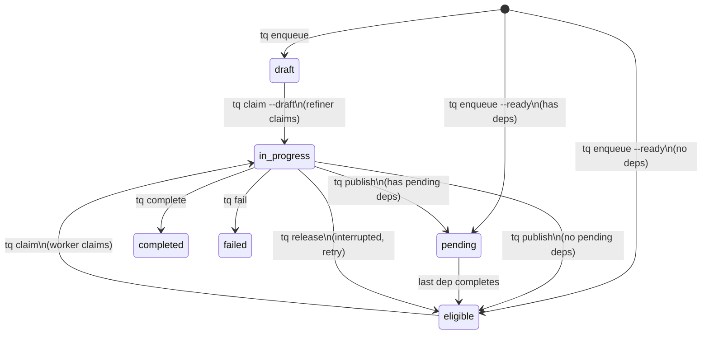
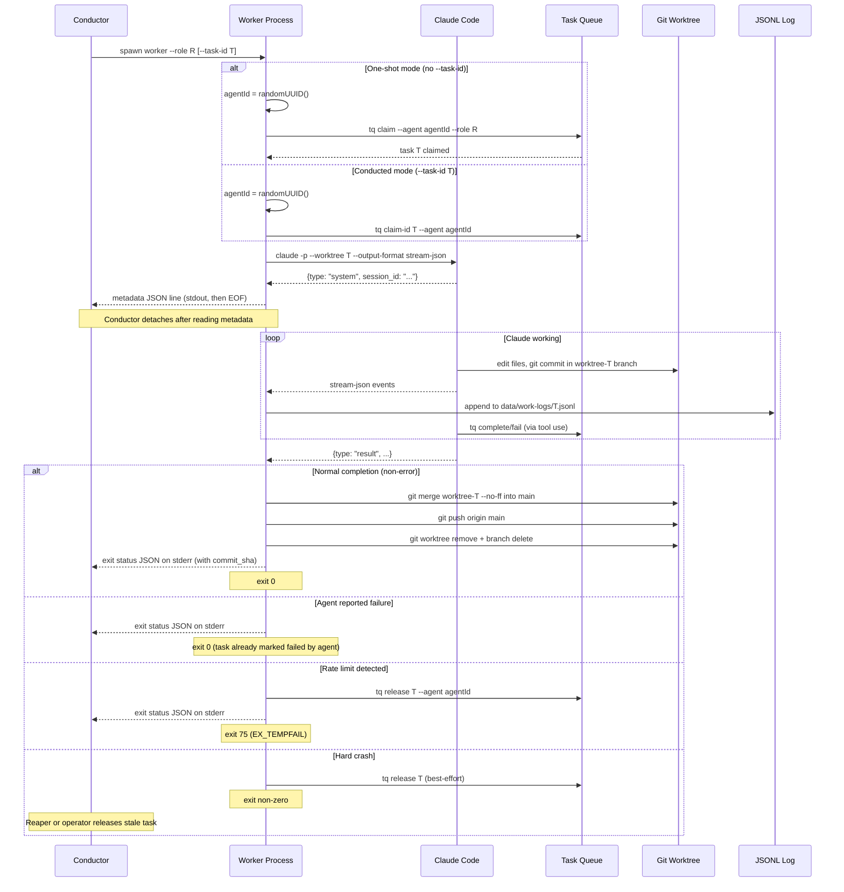
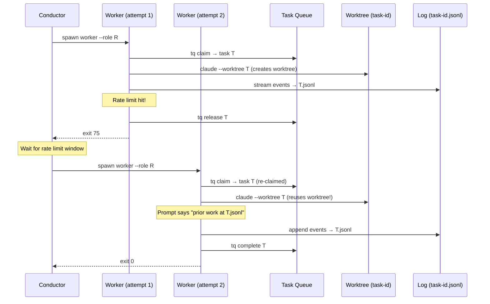

# Shardworks Architecture

## Overview

Shardworks is a task queue system that orchestrates multiple Claude Code agents
working on a shared codebase. A **conductor** (currently human, designed to be
replaceable by an agentic conductor) dispatches work to **workers**, which are
thin wrappers around `claude -p` that handle task lifecycle, logging, and
failure recovery.

The architecture is **task-centric**: the task ID is the durable identity that
ties together all persistent state. Agent IDs are ephemeral — generated fresh
on every worker invocation.



## Design Principles

### Task ID as Durable Identity

Every piece of persistent state is keyed by task ID:

| State | Location |
|-------|----------|
| Metadata & results | Dolt `tasks` table |
| Code changes | `.claude/worktrees/<task-id>/` |
| Work logs | `data/work-logs/<task-id>.jsonl` |

This means any number of agent invocations can work on the same task and all
state accumulates naturally. There is no need to coordinate agent IDs or
session IDs across invocations.

### Ephemeral Agent IDs

Agent IDs are `randomUUID()`, generated fresh on every worker startup. They
serve only two purposes:

1. **Claim ownership** — `claimed_by` in the DB prevents double-claiming
2. **Authorization** — `tq complete/fail/release` validates the agent matches

Agent IDs are never reused, stored, or passed between processes. The conductor
does not need to track them.

### Stateless Conductor

The conductor's job is simple: survey the backlog and spawn workers. It does
not need to track PIDs, agent IDs, session IDs, or retry state. Workers are
fire-and-forget — they claim, work, and exit.

If a worker is interrupted, the task eventually returns to `eligible` (via
`tq release` from the worker, or via a stale-task reaper). A new worker picks
it up with full context from the work log and git worktree.

### Log-Based Context Recovery

Instead of relying on `claude --resume` (which requires the exact session UUID,
same machine, intact `~/.claude/` directory), context recovery uses the JSONL
work log. When a worker starts on a task that has a prior log file, the work
prompt tells Claude about it:

> Previous work on this task was interrupted. The work log at
> `data/work-logs/<task-id>.jsonl` contains the prior session's tool calls and
> results. Review it to understand what was already done before continuing.

This approach is robust across machines, Claude sessions, and even different
Claude versions.

## Key Entities

### Tasks

A task is the unit of work. It lives in Dolt (MySQL-compatible) and tracks its
full lifecycle from creation to completion.

| Field | Purpose |
|-------|---------|
| `id` | Deterministic hash (e.g. `tq-0721ad7b`) |
| `status` | `draft` → `pending` → `eligible` → `in_progress` → `completed`/`failed` |
| `assigned_role` | Routes to a specific worker role; null = any role can claim |
| `claimed_by` | Ephemeral agent UUID of the current worker |
| `result_payload` | JSON written by the worker on completion — the permanent record |
| `dependencies` | DAG edges: this task waits for listed tasks to complete |
| `parent_id` | Hierarchy: groups sub-tasks under a parent |

### Workers

A worker is a **single-invocation process** that:

1. Claims a task (or is given a task ID by the conductor)
2. Generates a fresh agent UUID
3. Spawns `claude -p --worktree <task-id>` with role-specific prompts
4. Streams Claude's output to `data/work-logs/<task-id>.jsonl` (appending)
5. Emits a metadata line to stdout so the conductor can detach
6. Waits for Claude to finish
7. If rate-limited: releases the task and exits 75
8. **On successful completion: merges `worktree-<task-id>` → `main`, pushes, cleans up**
9. Exits with Claude's exit code

The merge step is the worker's responsibility — Claude commits freely within
its worktree but must not push to `main` directly.

Workers are **stateless between invocations** — all durable state lives in
external systems (Dolt, git worktrees, JSONL logs).

### Conductor

The conductor decides *what* to run and *when*. Today it's a human; the
interface is designed so an agentic conductor can replace it with no worker
changes.

**Conductor responsibilities:**

| Responsibility | Human workflow | Agentic workflow |
|----------------|---------------|------------------|
| Survey backlog | `tq ready`, `tq list`, `work dashboard` | Poll `tq ready` on interval |
| Spawn workers | `worker --role R` | `child_process.spawn(...)` |
| Monitor progress | `work watch <id>`, `work dashboard` | Parse metadata line, poll task status |
| Handle failures | Read exit code, re-run if needed | Detect exit code, backoff and retry |
| Manage capacity | Human judgment about concurrency | Slot management |

**Conductor contract with workers:**

1. Spawn `worker` with appropriate flags
2. Read exactly one JSON metadata line from stdout (then stdout closes)
3. Optionally stream stderr for interactive monitoring
4. Wait for exit code:
   - `0` = success (task completed or failed by the agent)
   - `75` = temporary failure (rate limit — task was released, retry later)
   - `1` = permanent failure (config error, spawn failure)
   - Other non-zero = unexpected crash (task may be orphaned)

The conductor does **not** need to pass `--agent-id` or `--resume-session`.
These concepts no longer exist in the worker interface.

### Roles

Roles are defined in `roles.json` and control:
- **Claim pool**: `claimDraft: true` → draft queue, `claimDraft: false` → eligible queue
- **Task routing**: Workers pass `--role` to `tq claim`, which filters on `assigned_role`
- **Prompts**: System and work prompts are templated per role

| Role | Claims from | Ends with | Task routing |
|------|------------|-----------|--------------|
| `implementer` | eligible (unassigned or assigned_role=implementer) | `tq complete` / `tq fail` | Default for most tasks |
| `refiner` | draft | `tq publish` | Single-task refinement |
| `planner` | eligible (assigned_role=planner) | `tq complete` | Cross-task backlog grooming |

## Lifecycle Diagrams

### Task Status Lifecycle



### Worker Process Lifecycle



### Task Recovery Flow (Rate Limit)



Key observation: Worker 2 uses a **different agent ID** but gets the **same
worktree** and **same log file** because both are keyed by task ID. Claude
sees the prior code changes in the worktree and can read the prior log for
context.

## Persistent State

Three persistence layers hold state across worker invocations, all keyed by
task ID:

### 1. Dolt DB (task state)

**What**: Task metadata, status, dependencies, result payloads.
**Lifetime**: Permanent.
**Accessed by**: `tq` CLI, workers (via `tq`), conductor, dashboard.

This is the **source of truth** for what work exists, what's in progress, and
what's done. Result payloads are the permanent record of completed work.

### 2. Git Worktrees (code state)

**What**: Isolated working copies at `.claude/worktrees/<task-id>/`.
**Lifetime**: Active while the task is in progress; deleted by the worker on
successful merge.
**Accessed by**: Claude Code (working directory for file edits).

Each task gets its own git worktree on branch `worktree-<task-id>`, so
multiple Claude instances can edit files concurrently without conflicts.
Claude commits freely within the worktree as it works.

**The worker is responsible for merging worktree changes back to `main`.**
After Claude exits successfully, the worker:

1. Checks if `worktree-<task-id>` has commits ahead of `main`
2. Runs `git merge worktree-<task-id> --no-ff` from the workspace root
3. Pushes `origin/main` (with one retry on concurrent-push collision)
4. Removes the worktree directory and local branch

If the merge fails (conflict), the worker fires a `merge_failed` conductor
signal and leaves the worktree intact for manual resolution.

**Claude must not** push branches or merge to `main` manually — the worker
handles this automatically. Claude's role prompt says so explicitly.

### 3. JSONL Work Logs (observability + context)

**What**: Complete stream-json output from every Claude invocation on a task.
**Lifetime**: Permanent (append-only).
**Accessed by**: `work watch`, `work dashboard`, worker prompts (for context
recovery), post-hoc analysis.
**Path**: `data/work-logs/<task-id>.jsonl`

Logs are append-only: if a task is retried, new events are appended to the
same file. This gives a complete timeline of all attempts on the task.

### Context Preservation Matrix

| Scenario | Task state | Code changes | Merged to main | Prior context | Log |
|----------|-----------|-------------|----------------|---------------|-----|
| Normal completion | ✅ result_payload | ✅ committed | ✅ worker merges + pushes | Not needed | ✅ complete |
| Rate limit (auto-release) | ✅ released → re-claimed | ✅ worktree intact | ⏳ pending retry | ✅ log in prompt | ✅ appended |
| Crash (new worker) | ⚠️ orphaned until reaped | ✅ worktree intact | ⏳ pending retry | ✅ log in prompt | ✅ appended |
| Merge conflict | ✅ result_payload | ✅ worktree intact | ❌ needs manual fix | Not needed | ✅ complete |
| Machine death | ⚠️ orphaned until reaped | ❌ worktree lost | ❌ lost | ❌ log may be lost | ⚠️ partial |

The common case (normal completion) fully integrates changes. Merge conflicts
are a rare case requiring operator intervention.

## Failure Modes and Recovery

### Rate Limit

The most common interruption. Claude exits immediately with a result event:
```json
{"type": "result", "is_error": true, "result": "You've hit your limit · resets 5pm (UTC)", "total_cost_usd": 0}
```

**Detection**: The launcher parses the `result` event. A rate limit is
identifiable by: `is_error === true` AND `total_cost_usd === 0` AND `result`
matches a rate-limit pattern (contains "hit your limit" or "resets").

**Recovery**: The worker calls `tq release`, writes a structured exit status to
stderr, and exits 75. The conductor (or human) waits and spawns a new worker.
The new worker claims the task, gets the same worktree, and the prompt mentions
the prior log file for context.

### Claude Crash / OOM / Unexpected Exit

**Detection**: Worker exits with non-zero code that isn't 75, or is killed by
signal.

**Recovery**: Conductor retries by spawning a new worker. Task may still be
`in_progress` (orphaned) — the reaper or operator releases it.

### Task Left Orphaned (no conductor watching)

**Detection**: An operator or scheduled job runs a reaper:
```bash
tq reap --stale-after 30m   # release in_progress tasks older than 30 min
```

**Recovery**: Tasks return to `eligible` and can be claimed by new workers.

## Exit Code Convention

| Code | Meaning | Conductor action |
|------|---------|-----------------|
| `0` | Success — task was completed or failed by the agent | No action needed |
| `75` | Temporary failure (rate limit, transient error) | Retry later (task already released) |
| `1` | Permanent failure (config error, spawn failure) | Alert operator, do not retry |
| Other | Unexpected crash | Release task, retry with limit |

Exit code 75 is `EX_TEMPFAIL` from sysexits.h — a well-established convention
for "try again later."

## Structured Exit Status

Before exiting, the worker writes a single JSON status line to stderr so the
conductor can make decisions without parsing logs:

```json
{"status": "rate_limited", "task_id": "tq-...", "agent_id": "...", "session_id": "...", "retry_after": "2026-03-16T17:00:00Z", "cost_usd": 0}
```

```json
{"status": "completed", "task_id": "tq-...", "agent_id": "...", "session_id": "...", "cost_usd": 0.1234}
```

```json
{"status": "crashed", "task_id": "tq-...", "agent_id": "...", "session_id": "...", "error": "claude exited with code 137"}
```

## Worker Interface

### Flags

```bash
worker                            # one-shot, claims next task for default role
worker --role implementer         # one-shot with explicit role
worker --role refiner             # one-shot refiner (claims from draft pool)
worker --task-id <id>             # conducted mode: claim specific task ID
worker --interactive              # force human-readable stderr
worker --no-interactive           # force silent stderr
```

Environment variables:
- `WORKER_ROLE` — default role (fallback for `--role`)
- `WORK_DIR` — workspace directory
- `CLAUDE_MODEL` — model to use (default: sonnet)
- `CLAUDE_MAX_BUDGET_USD` — cost cap per invocation
- `AGENT_TAGS` — comma-separated capability tags

### Metadata Line (stdout)

```json
{"agent_id":"...","task_id":"...","role":"implementer","session_id":"...","log_path":"data/work-logs/tq-xxxx.jsonl","pid":12345}
```

Stdout closes immediately after this line. The conductor reads it and detaches.

The exit status on stderr also includes `commit_sha` when a worktree merge
succeeded:

```json
{"status":"completed","task_id":"tq-...","agent_id":"...","session_id":"...","cost_usd":0.12,"commit_sha":"abc1234..."}
```
