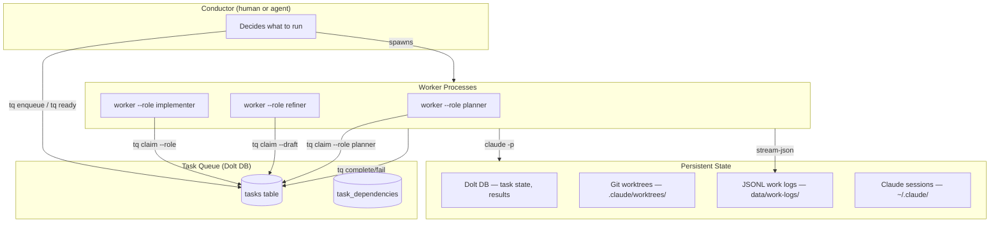
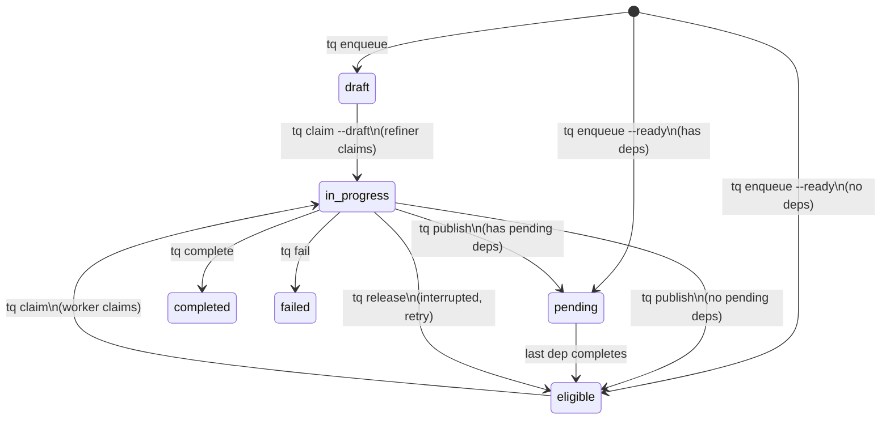
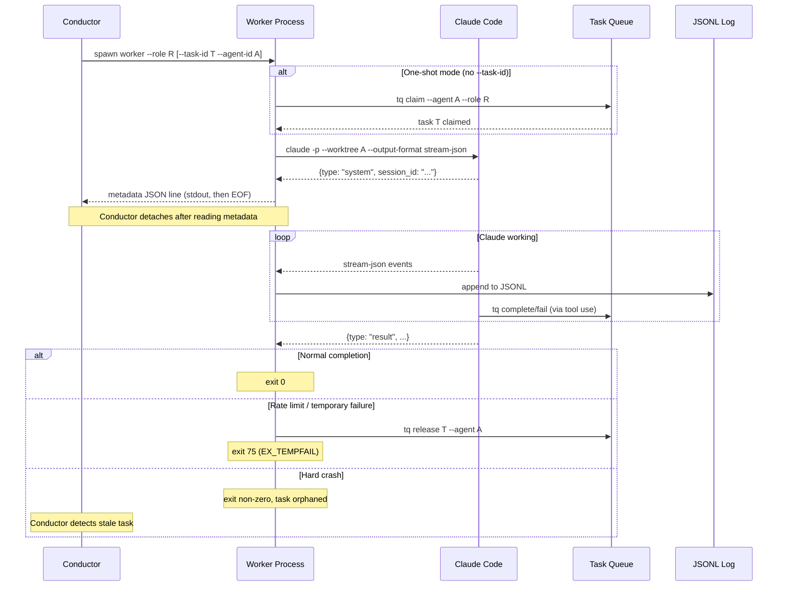
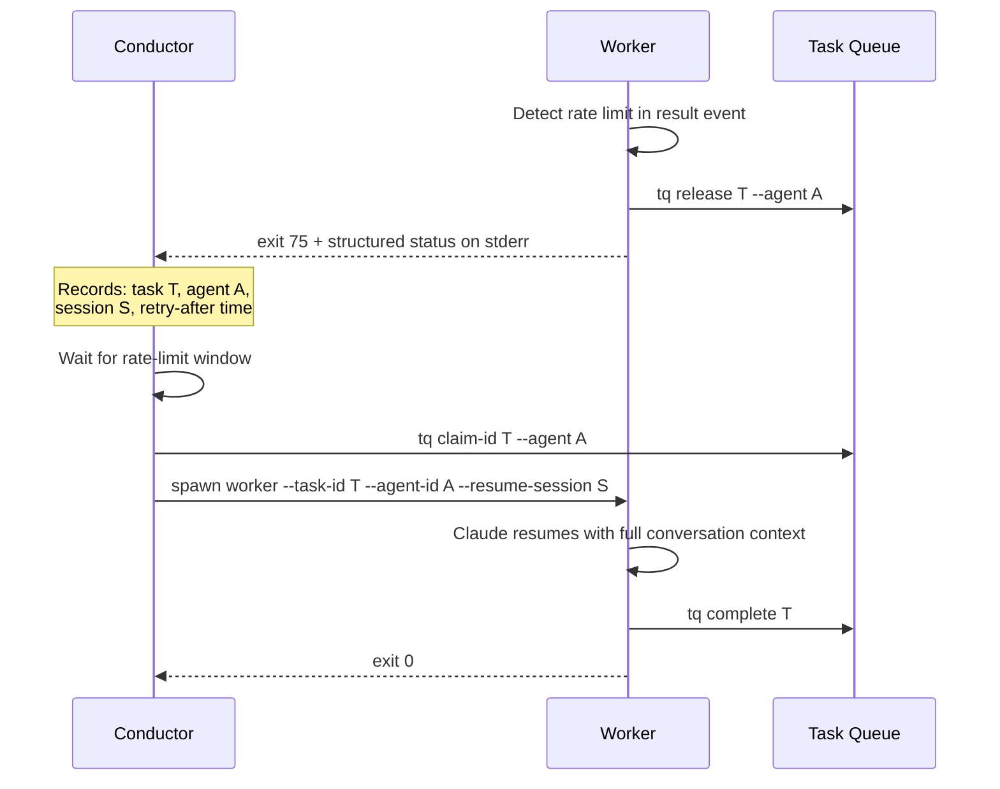

# Shardworks Architecture

## Overview

Shardworks is a task queue system that orchestrates multiple Claude Code agents
working on a shared codebase. A **conductor** (currently human, designed to be
replaceable by an agentic conductor) dispatches work to **workers**, which are
thin wrappers around `claude -p` that handle task lifecycle, logging, and
failure recovery.



## Key Entities

### Tasks

A task is the unit of work. It lives in Dolt (MySQL-compatible) and tracks its
full lifecycle from creation to completion.

| Field | Purpose |
|-------|---------|
| `id` | Deterministic hash (e.g. `tq-0721ad7b`) |
| `status` | `draft` → `pending` → `eligible` → `in_progress` → `completed`/`failed` |
| `assigned_role` | Routes to a specific worker role; null = any role can claim |
| `claimed_by` | Agent UUID of the worker that claimed this task |
| `result_payload` | JSON written by the worker on completion — the permanent record |
| `dependencies` | DAG edges: this task waits for listed tasks to complete |
| `parent_id` | Hierarchy: groups sub-tasks under a parent |

### Workers

A worker is a **single-invocation process** that:

1. Claims a task (or is given one by the conductor)
2. Spawns `claude -p` with role-specific prompts
3. Streams Claude's output to a JSONL log file
4. Emits a metadata line to stdout so the conductor can detach
5. Waits for Claude to finish, then exits

Workers are **stateless between invocations** — all durable state lives in
external systems (Dolt, git worktrees, Claude sessions, JSONL logs).

### Agents

An agent is a **logical identity** (a UUID) that persists across worker
invocations for the same task. The agent ID determines:

- Which git worktree Claude operates in (`.claude/worktrees/<agent-id>/`)
- Where JSONL logs are written (`data/work-logs/<agent-id>/<task-id>.jsonl`)
- Which Claude session can be resumed (`--resume-session`)
- Who is authorized to complete/fail the claimed task (`claimed_by`)

**Key insight**: The agent ID outlives any single worker process. When a worker
is interrupted and later restarted for the same task, reusing the same agent ID
preserves the git worktree, log continuity, and session resumability.

### Conductor

The conductor decides *what* to run and *when*. Today it's a human; the
interface is designed so an agentic conductor can replace it with no worker
changes.

**Conductor responsibilities:**

| Responsibility | Human workflow | Agentic workflow |
|----------------|---------------|------------------|
| Survey backlog | `tq ready`, `tq list`, `work dashboard` | Poll `tq ready` on interval |
| Spawn workers | `worker --role R` or `worker --task-id T --agent-id A` | `child_process.spawn(...)` |
| Monitor progress | `work watch <id>`, `work dashboard` | Parse metadata line, poll task status |
| Handle failures | Read exit code, manually release/retry | Detect exit code, auto-release + backoff |
| Manage capacity | Human judgment about concurrency | Rate-limit tracking, slot management |

**Conductor contract with workers:**

1. Spawn `worker` with appropriate flags
2. Read exactly one JSON metadata line from stdout (then stdout closes)
3. Optionally stream stderr for interactive monitoring
4. Wait for exit code:
   - `0` = success (task completed or failed by the agent)
   - `75` = temporary failure (rate limit, should retry later) ⭐ *proposed*
   - Other non-zero = unexpected crash

### Roles

Roles are defined in `roles.json` and control:
- **Claim pool**: `claimDraft: true` → draft queue, `claimDraft: false` → eligible queue
- **Task routing**: Workers pass `--role` to `tq claim`, which filters on `assigned_role`
- **Prompts**: System and work prompts are templated per role

| Role | Claims from | Ends with | Task routing |
|------|------------|-----------|--------------|
| `implementer` | eligible (unassigned or assigned_role=implementer) | `tq complete` / `tq fail` | Default for most tasks |
| `refiner` | draft | `tq publish` | Single-task refinement |
| `planner` | eligible (assigned_role=planner) | `tq complete` | Cross-task backlog grooming |

## Lifecycle Diagrams

### Task Status Lifecycle



The `tq release` transition (⭐ proposed) enables recovery from interrupted
workers without losing the task.

### Worker Process Lifecycle



## Persistent State and Context

Four independent persistence layers hold state across worker invocations:

### 1. Dolt DB (task state)

**What**: Task metadata, status, dependencies, result payloads.  
**Lifetime**: Permanent.  
**Accessed by**: `tq` CLI, workers (via `tq`), conductor, dashboard.

This is the **source of truth** for what work exists, what's in progress, and
what's done. Result payloads are the permanent record of completed work.

### 2. Git Worktrees (code state)

**What**: Isolated working copies at `.claude/worktrees/<agent-id>/`.  
**Lifetime**: Survives worker restarts; persists as long as the worktree exists.  
**Accessed by**: Claude Code (working directory for file edits).

Each agent gets its own worktree so multiple Claude instances can edit files
concurrently without conflicts. When a worker is restarted with the same agent
ID, Claude picks up the same worktree with any uncommitted changes still present.

### 3. Claude Sessions (conversation state)

**What**: Claude's internal conversation history, tool call results, etc.  
**Lifetime**: Managed by Claude Code; persists in `~/.claude/`.  
**Accessed by**: `claude --resume <session-id>`.

**This is the most important context for recovery.** When a worker is resumed
with `--resume-session`, Claude sees the full conversation history including
all prior tool calls and results. It can pick up exactly where it left off —
no re-reading files, no re-understanding the task.

### 4. JSONL Work Logs (observability)

**What**: Complete stream-json output from every Claude invocation.  
**Lifetime**: Permanent (append-only).  
**Accessed by**: `work watch`, `work dashboard`, post-hoc analysis.  
**Path**: `data/work-logs/<agent-id>/<task-id>.jsonl`

Logs are append-only: if a worker is restarted and resumed, new events are
appended to the same file. This gives a complete timeline of all attempts.

### Context Preservation Matrix

| Scenario | Task state | Code changes | Conversation | Log |
|----------|-----------|-------------|--------------|-----|
| Normal completion | ✅ result_payload | ✅ committed | Session exists but unneeded | ✅ complete |
| Rate limit (same agent, resume) | ✅ released → re-claimed | ✅ worktree intact | ✅ `--resume` restores full context | ✅ appended |
| Rate limit (same agent, fresh) | ✅ released → re-claimed | ✅ worktree intact | ❌ starts over | ✅ appended |
| Crash (same agent, resume) | ⚠️ stuck until released | ✅ worktree intact | ✅ `--resume` restores | ✅ appended |
| Crash (different agent) | ⚠️ stuck until released | ❌ new worktree | ❌ starts over | New file |

**The ideal recovery path** reuses the same agent ID and resumes the session.
This preserves all four layers of state.

## Failure Modes and Recovery

### Rate Limit

The most common interruption. Claude exits immediately with a result event:
```json
{"type": "result", "is_error": true, "result": "You've hit your limit · resets 5pm (UTC)", "total_cost_usd": 0}
```

**Detection**: The launcher already parses the `result` event. A rate limit is
identifiable by: `is_error === true` AND `total_cost_usd === 0` AND `result`
matches a rate-limit pattern (e.g. contains "hit your limit" or "resets").

**Desired recovery flow:**



**Key design points:**
- The worker releases the task (not fails it) — this is a retry, not a failure
- The conductor stores the session ID from the original metadata line
- Re-claim uses `tq claim-id` so the same agent gets the same task back
- `--resume-session` gives Claude the full prior conversation
- Same agent ID → same git worktree → code changes preserved

### Claude Crash / OOM / Unexpected Exit

**Detection**: Worker exits with non-zero code that isn't 75, or is killed by signal.

**Recovery**: Same as rate limit, minus the "wait for window" step. The
conductor can retry immediately (possibly with a retry limit).

### Worker Process Killed (SIGKILL, machine death)

**Detection**: The conductor's child process exits, or the PID in the metadata
is no longer running. Alternatively, a reaper polls for `in_progress` tasks
whose `claimed_at` is older than a threshold.

**Recovery**: Conductor releases the task and re-dispatches. If the agent is
unreachable (different machine), a new agent ID is needed and conversation
context is lost — but code changes on the original worktree may be recoverable.

### Task Left Orphaned (no conductor watching)

**Detection**: An operator or scheduled job runs a reaper:
```bash
tq reap --stale-after 30m   # release in_progress tasks older than 30 min with no live worker
```

**Recovery**: Tasks return to `eligible` and can be claimed by new workers. If
the original session is known, it can be passed to the new worker for context
preservation.

## Exit Code Convention

| Code | Meaning | Conductor action |
|------|---------|-----------------|
| `0` | Success — task was completed or failed by the agent | No action needed |
| `75` | Temporary failure (rate limit, transient error) | Retry later (with backoff / timer) |
| `1` | Permanent failure (config error, spawn failure) | Alert operator, do not retry |
| Other | Unexpected crash | Retry with limit, then alert |

Exit code 75 is `EX_TEMPFAIL` from sysexits.h — a well-established convention
for "try again later."

## Structured Exit Status

When the worker exits, it should write a structured status line to stderr so the
conductor doesn't need to parse logs:

```json
{"status": "rate_limited", "task_id": "tq-...", "agent_id": "...", "session_id": "...", "retry_after": "2026-03-16T17:00:00Z", "cost_usd": 0}
```

```json
{"status": "completed", "task_id": "tq-...", "agent_id": "...", "session_id": "...", "cost_usd": 0.1234}
```

```json
{"status": "crashed", "task_id": "tq-...", "agent_id": "...", "session_id": "...", "error": "claude exited with code 137"}
```

This lets the conductor make decisions without reading the JSONL log.

---

## Required Changes

### 1. `tq release` command (task queue)

Add a new `tq release <task-id> --agent <agent-id>` command:
- Transitions `in_progress → eligible`
- Clears `claimed_by` and `claimed_at`
- Validates the agent matches `claimed_by` (or allow `--force` for operators)
- Sets `eligible_at` to now (so it re-enters the priority queue)

This is distinct from `tq fail` (permanent) and `tq publish` (refiner-only).

### 2. Rate-limit detection in launcher

Parse the `result` event in `launcher.ts`. When the result indicates a rate
limit:
- Emit a structured exit status to stderr
- Call `tq release` to free the task
- Exit with code 75

Detection heuristic: `is_error === true` AND (`total_cost_usd === 0` OR
`result` matches `/hit your limit|rate.limit|resets \d/i`).

Also parse the "resets" time from the message when present, and include it in
the structured status as `retry_after`.

### 3. Structured exit status on worker completion

After Claude exits (any reason), the worker writes a single JSON status line
to stderr before exiting. This gives the conductor everything it needs:
- `task_id`, `agent_id`, `session_id` — for retry/resume
- `status` — `completed`, `failed`, `rate_limited`, `crashed`
- `retry_after` — ISO timestamp if rate-limited
- `cost_usd` — total cost from the result event

### 4. `tq claim-id` for conductor-initiated re-claim

Already implemented. The conductor uses this to re-claim a specific task for
a specific agent after a release, ensuring the same agent gets it back.

Note: `tq claim-id` currently requires the task to be in `eligible` status.
After `tq release`, the task will be `eligible`, so this works as-is.

### 5. `tq reap` command for stale tasks (optional, for robustness)

A reaper command that finds orphaned `in_progress` tasks:
```bash
tq reap --stale-after 30m          # list stale tasks
tq reap --stale-after 30m --release # release them back to eligible
```

Useful for scenarios where the conductor itself crashes, or for a cron-like
safety net.

### 6. Worker exit handling in `index.ts`

After `handle.done` resolves, the worker should:
1. Parse the final `result` event from the log (or capture it in the launcher)
2. Determine the exit status category
3. If rate-limited: release the task, write status, exit 75
4. If normal: write status, exit 0
5. If crashed: write status, exit 1

### Priority Order

| # | Change | Effort | Unlocks |
|---|--------|--------|---------|
| 1 | `tq release` command | Small | Ability to recover tasks without failing them |
| 2 | Rate-limit detection + auto-release | Medium | Workers self-heal on rate limits |
| 3 | Structured exit status | Small | Conductor can make decisions without log parsing |
| 4 | Worker exit handling (`index.ts`) | Medium | Ties it all together end-to-end |
| 5 | `tq reap` | Small | Safety net for hard crashes |
