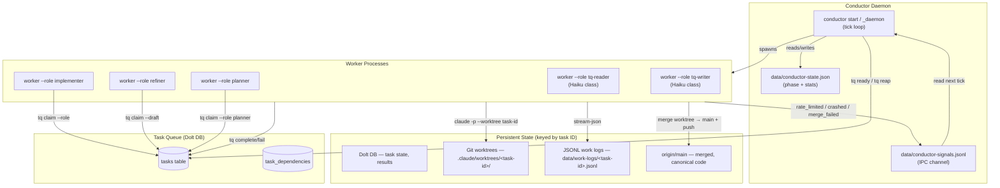
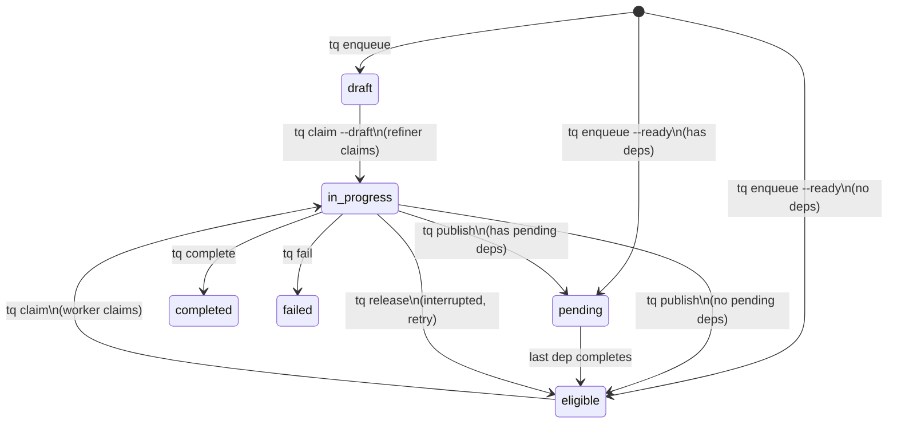
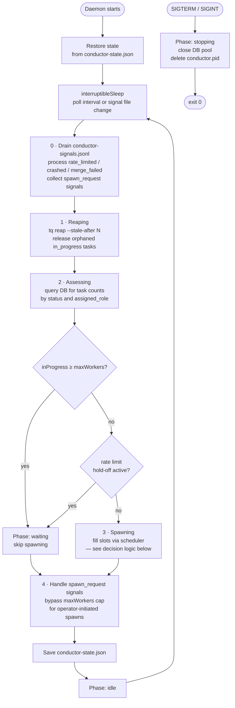
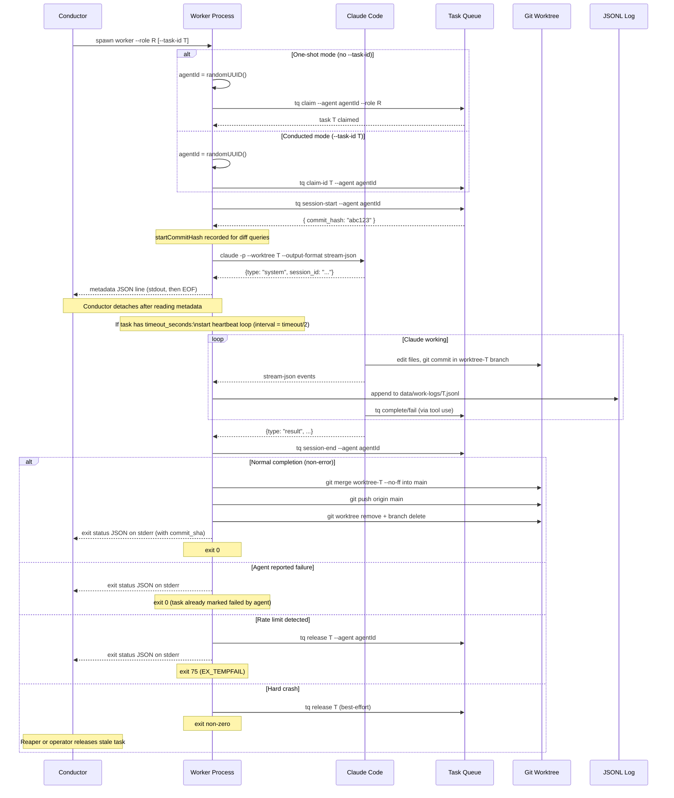
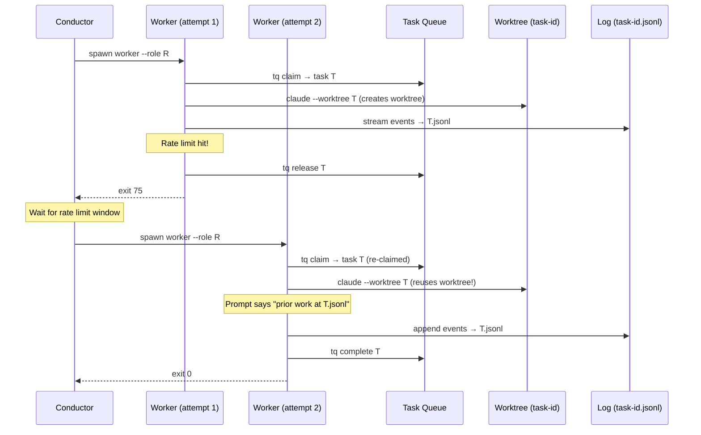
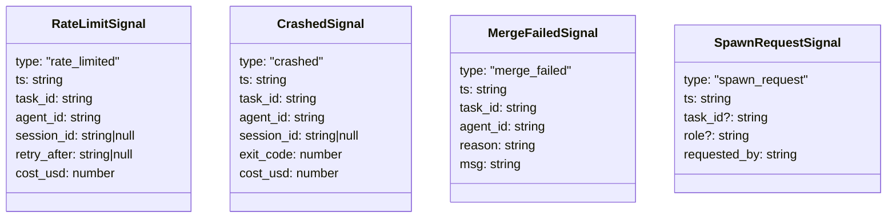
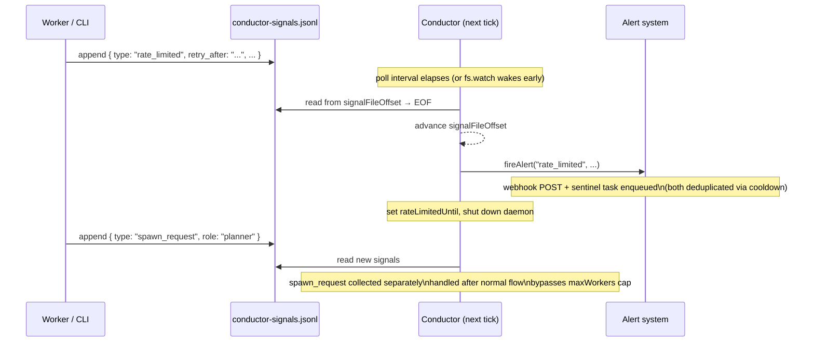
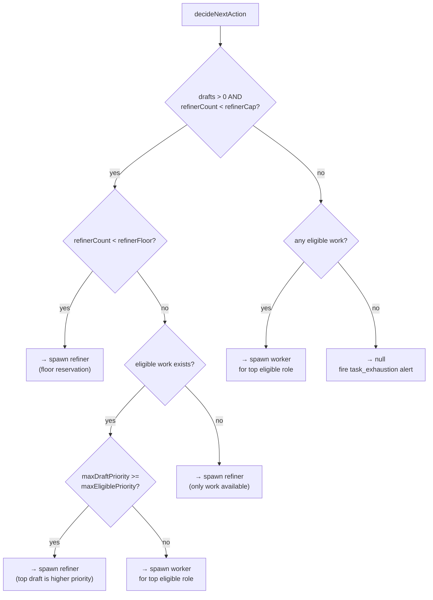
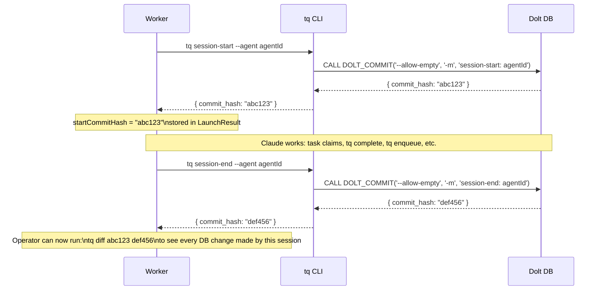
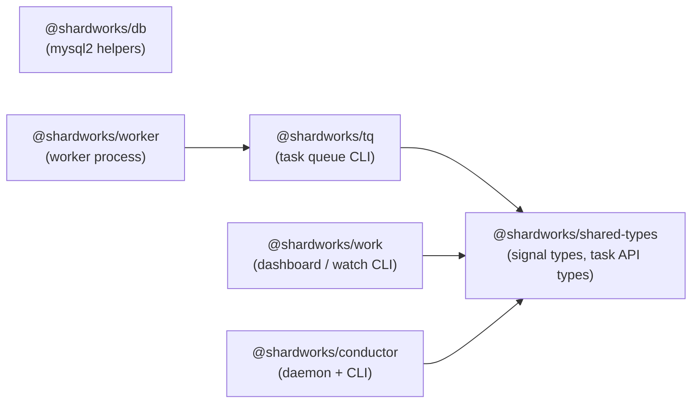

# Shardworks Architecture

## Overview

Shardworks is a task queue system that orchestrates multiple Claude Code agents
working on a shared codebase. A **conductor daemon** continuously surveys the
task backlog and spawns **workers**, which are thin wrappers around `claude -p`
that handle task lifecycle, logging, and failure recovery.

The architecture is **task-centric**: the task ID is the durable identity that
ties together all persistent state. Agent IDs are ephemeral — generated fresh
on every worker invocation.



## Design Principles

### Task ID as Durable Identity

Every piece of persistent state is keyed by task ID:

| State | Location |
|-------|----------|
| Metadata & results | Dolt `tasks` table |
| Code changes | `.claude/worktrees/<task-id>/` |
| Work logs | `data/work-logs/<task-id>.jsonl` |

This means any number of agent invocations can work on the same task and all
state accumulates naturally. There is no need to coordinate agent IDs or
session IDs across invocations.

### Ephemeral Agent IDs

Agent IDs are `randomUUID()`, generated fresh on every worker startup. They
serve only two purposes:

1. **Claim ownership** — `claimed_by` in the DB prevents double-claiming
2. **Authorization** — `tq complete/fail/release` validates the agent matches

Agent IDs are never reused, stored, or passed between processes. The conductor
does not need to track them.

### Autonomous Conductor Daemon

The conductor daemon runs as a background process (`conductor start`). It
continuously polls the task queue, spawns workers to fill available slots, and
processes asynchronous signals from workers. The conductor is fully automated:
it needs no human interaction during normal operation.

If a worker is interrupted, the task eventually returns to `eligible` (via
`tq release` from the worker, or via a stale-task reaper). A new worker picks
it up with full context from the work log and git worktree.

### Log-Based Context Recovery

Instead of relying on `claude --resume` (which requires the exact session UUID,
same machine, intact `~/.claude/` directory), context recovery uses the JSONL
work log. When a worker starts on a task that has a prior log file, the work
prompt tells Claude about it:

> Previous work on this task was interrupted. The work log at
> `data/work-logs/<task-id>.jsonl` contains the prior session's tool calls and
> results. Review it to understand what was already done before continuing.

This approach is robust across machines, Claude sessions, and even different
Claude versions.

## Key Entities

### Tasks

A task is the unit of work. It lives in Dolt (MySQL-compatible) and tracks its
full lifecycle from creation to completion.

| Field | Purpose |
|-------|---------|
| `id` | Deterministic hash (e.g. `tq-0721ad7b`) |
| `status` | `draft` → `pending` → `eligible` → `in_progress` → `completed`/`failed` |
| `assigned_role` | Routes to a specific worker role; null = any role can claim |
| `claimed_by` | Ephemeral agent UUID of the current worker |
| `result_payload` | JSON written by the worker on completion — the permanent record |
| `dependencies` | DAG edges: this task waits for listed tasks to complete |
| `parent_id` | Hierarchy: groups sub-tasks under a parent |
| `timeout_seconds` | Optional task-level timeout; heartbeats enforce it |

### Workers

A worker is a **single-invocation process** that:

1. Claims a task (or is given a task ID by the conductor)
2. Generates a fresh agent UUID
3. Calls `tq session-start` to bracket the Dolt commit log
4. Spawns `claude -p --worktree <task-id>` with role-specific prompts
5. Starts a heartbeat loop if the task has a `timeout_seconds` configured
6. Streams Claude's output to `data/work-logs/<task-id>.jsonl` (appending)
7. Emits a metadata line to stdout so the conductor can detach
8. Waits for Claude to finish
9. Calls `tq session-end` to close the Dolt commit bracket
10. If rate-limited: releases the task and exits 75
11. **On successful completion: merges `worktree-<task-id>` → `main`, pushes, cleans up**
12. Exits with Claude's exit code

The merge step is the worker's responsibility — Claude commits freely within
its worktree but must not push to `main` directly.

Workers are **stateless between invocations** — all durable state lives in
external systems (Dolt, git worktrees, JSONL logs).

### Conductor Daemon

The conductor daemon is started with `conductor start` and runs as a detached
background process. It runs a tick loop that:

1. **Drains signals** — reads new entries from `data/conductor-signals.jsonl`
   written by workers, fires alerts, and handles `spawn_request` signals.
2. **Reaps stale tasks** — releases `in_progress` tasks stuck past the
   configured `staleAfter` threshold (default: 30 minutes).
3. **Assesses capacity** — queries the DB for task counts per status/role and
   compares against `maxWorkers`.
4. **Spawns workers** — fills available slots using the priority-aware
   scheduler (see [Scheduler](#scheduler-and-capacity-policy)).
5. **Handles operator spawn requests** — any `spawn_request` signals collected
   in step 1 are dispatched here, bypassing the `maxWorkers` cap.

Between ticks the daemon sleeps via `interruptibleSleep`: it wakes after the
configured poll interval (default: 30 s) **or** immediately whenever the signal
file changes, ensuring fast response to urgent events.

### Roles

Roles are defined in `roles.json` and control:
- **Claim pool**: `claimDraft: true` → draft queue, `claimDraft: false` → eligible queue
- **Task routing**: Workers pass `--role` to `tq claim`, which filters on `assigned_role`
- **Prompts**: System and work prompts are templated per role
- **Allowed tools**: Restricted per role to reduce token overhead and prevent unintended actions
- **Model**: `haiku` for mechanical roles that need no reasoning

| Role | Claims from | Ends with | Task routing | Model |
|------|------------|-----------|--------------|-------|
| `implementer` | eligible (unassigned or assigned_role=implementer) | `tq complete` / `tq fail` | Default for most tasks | sonnet |
| `refiner` | draft | `tq publish` | Single-task refinement | sonnet |
| `planner` | eligible (assigned_role=planner) | `tq complete` | Cross-task backlog grooming | sonnet |
| `tq-reader` | eligible (assigned_role=tq-reader) | `tq complete` | Mechanical read-only tq commands | haiku |
| `tq-writer` | eligible (assigned_role=tq-writer) | `tq complete` | Mechanical tq state-change commands | haiku |

`tq-reader` and `tq-writer` are Haiku-class mechanical roles. They execute
read-only (`show`, `list`, `dep-results`) or write (`complete`, `fail`,
`publish`, `cancel`, `link`) tq commands exactly as specified in the task
payload — no reasoning required. Planners use them to batch large volumes of
mechanical writes cheaply.

## Lifecycle Diagrams

### Task Status Lifecycle



### Conductor Tick Loop



### Conductor Phase Summary

| Phase | What's happening |
|-------|-----------------|
| `starting` | Daemon initialising, restoring prior state |
| `idle` | Sleeping between ticks |
| `reaping` | Running `tq reap` to release stale in_progress tasks |
| `assessing` | Querying DB for task counts |
| `spawning` | Calling `worker --role R` for each available slot |
| `waiting` | At capacity or rate-limited — no spawning this tick |
| `stopping` | Received SIGTERM/SIGINT; shutting down gracefully |

### Worker Process Lifecycle



### Task Recovery Flow (Rate Limit)



Key observation: Worker 2 uses a **different agent ID** but gets the **same
worktree** and **same log file** because both are keyed by task ID. Claude
sees the prior code changes in the worktree and can read the prior log for
context.

## Signal System

Workers communicate asynchronously with the conductor via an append-only JSONL
file: `data/conductor-signals.jsonl`. Workers append signals using simple file
I/O; the conductor reads new entries on each tick using a byte-offset cursor
(resuming from where it last stopped).

### Signal Types



### Signal Flow



**Signal file properties:**
- **Append-only** — workers never truncate or seek; they only `appendFile`.
- **Byte-offset cursor** — the conductor tracks `signalFileOffset` in its state
  file so it never re-processes old signals after a restart.
- **Truncation safety** — if the file shrinks (e.g. rotated by an operator),
  the conductor resets the offset to 0 and replays from the beginning.
- **`spawn_request` separation** — these are collected but handled after the
  normal scheduling loop so they can bypass the `maxWorkers` cap without
  interfering with regular capacity management.

### Alert System

Alerts fire on four event types. Each has a cooldown to prevent spam:

| Alert type | Cooldown | Trigger |
|-----------|---------|---------|
| `rate_limited` | 5 min | Worker hit Claude rate limit |
| `crashed` | 10 min | Worker exited with unexpected non-zero code |
| `merge_failed` | 10 min | Worktree merge to main failed (conflict) |
| `task_exhaustion` | 60 min | No draft or eligible tasks remain in queue |

For each alert, the system:
1. **POSTs to a webhook** (Slack/Discord/ntfy.sh format) if `CONDUCTOR_ALERT_WEBHOOK` is set.
2. **Creates a sentinel task** with `assigned_role=human` and `priority=999` so
   it appears prominently in the dashboard. The sentinel is deduplicated: if
   one already exists for that alert type, creation is skipped.

Sentinel task descriptions follow the pattern:
```
⚠ Human attention needed [rate_limited]: Worker hit rate limit on task tq-xxxx
```

## Scheduler and Capacity Policy

### Decision Logic

On each tick the scheduler fills available worker slots by calling
`decideNextAction` for each open slot. The decision is priority-aware:



### Refiner Capacity Policy

Refiners are bounded by two thresholds (applied as fractions of `maxWorkers`):

| Threshold | Default fraction | Minimum | Purpose |
|-----------|-----------------|---------|---------|
| `refinerCap` | 40% | 1 | Hard ceiling — never spawn beyond this |
| `refinerFloor` | 10% | 1 | Reserved floor — force a refiner when below this and drafts exist |

**Why a floor?** Without it, a long backlog of eligible tasks would monopolise
all worker slots, starving the refiner. The floor ensures at least one refiner
slot is always reserved when there are drafts to process.

**Why a cap?** Without it, large draft batches could fill all slots with
refiners, starving implementers. The cap ensures implementers can always make
forward progress on already-eligible work.

**Priority-aware comparison:** When both draft and eligible tasks exist and the
refiner count is between floor and cap, the scheduler compares
`maxDraftPriority` vs `maxEligiblePriority`. If a high-priority draft is more
urgent than any eligible task, a refiner is spawned; otherwise an implementer
(or role-matched worker) is spawned first.

### Role-Specific Eligible Tasks

The `tq claim` command routes tasks based on `assigned_role`:
- `assigned_role = null` → any worker can claim (implementers pick these up)
- `assigned_role = "planner"` → only a worker with `--role planner` can claim
- `assigned_role = "human"` → no worker will ever claim (sentinel tasks)

The scheduler reads `eligibleByRole` counts from the DB and spawns a worker
with `--role <assignedRole>` for each non-null role that has eligible tasks and
a matching entry in `roles.json`. Roles not defined in `roles.json`
(e.g. `"human"`) are silently skipped.

## Session Brackets

Each Claude invocation is wrapped in a **Dolt session bracket** to create a
precise audit trail of all database mutations made during that agent session.



**Properties:**
- `tq session-start` returns the Dolt commit hash just before Claude runs.
- `tq session-end` commits after Claude exits (before or after the task
  completes, even on crash — the worker calls it in a `finally`-equivalent).
- Both use `--allow-empty` so they always create a commit regardless of whether
  the DB changed.
- Errors from either command are logged as warnings and never crash the worker;
  session brackets are observability aids, not correctness requirements.
- The `startCommitHash` is included in the worker's exit status on stderr,
  making it easy for operators to diff any session post-hoc.

## Persistent State

Three persistence layers hold state across worker invocations, all keyed by
task ID:

### 1. Dolt DB (task state)

**What**: Task metadata, status, dependencies, result payloads.
**Lifetime**: Permanent.
**Accessed by**: `tq` CLI, workers (via `tq`), conductor, dashboard.

This is the **source of truth** for what work exists, what's in progress, and
what's done. Result payloads are the permanent record of completed work.

### 2. Git Worktrees (code state)

**What**: Isolated working copies at `.claude/worktrees/<task-id>/`.
**Lifetime**: Active while the task is in progress; deleted by the worker on
successful merge.
**Accessed by**: Claude Code (working directory for file edits).

Each task gets its own git worktree on branch `worktree-<task-id>`, so
multiple Claude instances can edit files concurrently without conflicts.
Claude commits freely within the worktree as it works.

**The worker is responsible for merging worktree changes back to `main`.**
After Claude exits successfully, the worker:

1. Checks if `worktree-<task-id>` has commits ahead of `main`
2. Runs `git merge worktree-<task-id> --no-ff` from the workspace root
3. Pushes `origin/main` (with one retry on concurrent-push collision)
4. Removes the worktree directory and local branch

If the merge fails (conflict), the worker fires a `merge_failed` conductor
signal and leaves the worktree intact for manual resolution.

**Claude must not** push branches or merge to `main` manually — the worker
handles this automatically. Claude's role prompt says so explicitly.

### 3. JSONL Work Logs (observability + context)

**What**: Complete stream-json output from every Claude invocation on a task.
**Lifetime**: Permanent (append-only).
**Accessed by**: `work watch`, `work dashboard`, worker prompts (for context
recovery), post-hoc analysis.
**Path**: `data/work-logs/<task-id>.jsonl`

Logs are append-only: if a task is retried, new events are appended to the
same file. This gives a complete timeline of all attempts on the task.

### Context Preservation Matrix

| Scenario | Task state | Code changes | Merged to main | Prior context | Log |
|----------|-----------|-------------|----------------|---------------|-----|
| Normal completion | ✅ result_payload | ✅ committed | ✅ worker merges + pushes | Not needed | ✅ complete |
| Rate limit (auto-release) | ✅ released → re-claimed | ✅ worktree intact | ⏳ pending retry | ✅ log in prompt | ✅ appended |
| Crash (new worker) | ⚠️ orphaned until reaped | ✅ worktree intact | ⏳ pending retry | ✅ log in prompt | ✅ appended |
| Merge conflict | ✅ result_payload | ✅ worktree intact | ❌ needs manual fix | Not needed | ✅ complete |
| Machine death | ⚠️ orphaned until reaped | ❌ worktree lost | ❌ lost | ❌ log may be lost | ⚠️ partial |

The common case (normal completion) fully integrates changes. Merge conflicts
are a rare case requiring operator intervention.

## Failure Modes and Recovery

### Rate Limit

The most common interruption. Claude exits immediately with a result event:
```json
{"type": "result", "is_error": true, "result": "You've hit your limit · resets 5pm (UTC)", "total_cost_usd": 0}
```

**Detection**: The launcher parses the `result` event. A rate limit is
identifiable by: `is_error === true` AND `total_cost_usd === 0` AND `result`
matches a rate-limit pattern (contains "hit your limit" or "resets").

**Recovery**: The worker calls `tq release`, writes a structured exit status to
stderr, and exits 75. The worker also appends a `rate_limited` signal to
`conductor-signals.jsonl`. On the next tick the conductor reads the signal,
fires a `rate_limited` alert, sets a `rateLimitedUntil` hold-off, and shuts
down (if the rate limit affects the whole API key).

### Claude Crash / OOM / Unexpected Exit

**Detection**: Worker exits with non-zero code that isn't 75, or is killed by
signal. The worker appends a `crashed` signal to `conductor-signals.jsonl`.

**Recovery**: Conductor reads the crash signal, fires a `crashed` alert, and
retries by spawning a new worker. Task may still be `in_progress` (orphaned) —
the reaper or operator releases it.

### Task Left Orphaned (no conductor watching)

**Detection**: An operator or scheduled job runs a reaper:
```bash
tq reap --stale-after 30m   # release in_progress tasks older than 30 min
```

The conductor daemon also runs this automatically on every tick via phase 1
(reaping).

**Recovery**: Tasks return to `eligible` and can be claimed by new workers.

## Exit Code Convention

| Code | Meaning | Conductor action |
|------|---------|-----------------|
| `0` | Success — task was completed or failed by the agent | No action needed |
| `75` | Temporary failure (rate limit, transient error) | Retry later (task already released) |
| `1` | Permanent failure (config error, spawn failure) | Alert operator, do not retry |
| Other | Unexpected crash | Release task, retry with limit |

Exit code 75 is `EX_TEMPFAIL` from sysexits.h — a well-established convention
for "try again later."

## Structured Exit Status

Before exiting, the worker writes a single JSON status line to stderr so the
conductor can make decisions without parsing logs:

```json
{"status": "rate_limited", "task_id": "tq-...", "agent_id": "...", "session_id": "...", "retry_after": "2026-03-16T17:00:00Z", "cost_usd": 0}
```

```json
{"status": "completed", "task_id": "tq-...", "agent_id": "...", "session_id": "...", "cost_usd": 0.1234}
```

```json
{"status": "crashed", "task_id": "tq-...", "agent_id": "...", "session_id": "...", "error": "claude exited with code 137"}
```

## Worker Interface

### Flags

```bash
worker                            # one-shot, claims next task for default role
worker --role implementer         # one-shot with explicit role
worker --role refiner             # one-shot refiner (claims from draft pool)
worker --task-id <id>             # conducted mode: claim specific task ID
worker --interactive              # force human-readable stderr
worker --no-interactive           # force silent stderr
```

Environment variables:
- `WORKER_ROLE` — default role (fallback for `--role`)
- `WORK_DIR` — workspace directory
- `CLAUDE_MODEL` — model to use (default: sonnet)
- `CLAUDE_MAX_BUDGET_USD` — cost cap per invocation
- `AGENT_TAGS` — comma-separated capability tags

### Metadata Line (stdout)

```json
{"agent_id":"...","task_id":"...","role":"implementer","session_id":"...","log_path":"data/work-logs/tq-xxxx.jsonl","worker_pid":12345,"claude_pid":12346}
```

Stdout closes immediately after this line. The conductor reads it and detaches.

The exit status on stderr also includes `commit_sha` when a worktree merge
succeeded:

```json
{"status":"completed","task_id":"tq-...","agent_id":"...","session_id":"...","cost_usd":0.12,"commit_sha":"abc1234..."}
```

## Conductor Interface

```bash
conductor start [options]    # Start the daemon in the background
conductor stop               # Send SIGTERM; wait for graceful shutdown
conductor status [--watch]   # Show phase, stats, and active workers
conductor logs [-n N]        # Tail data/conductor.jsonl (structured JSONL)
```

Environment / flags:

| Variable / Flag | Default | Purpose |
|-----------------|---------|---------|
| `CONDUCTOR_MAX_WORKERS` / `-n` | 3 | Concurrent worker cap |
| `CONDUCTOR_POLL_INTERVAL` | 30 (s) | Seconds between ticks |
| `CONDUCTOR_STALE_AFTER` | `30m` | Release in_progress tasks after this duration |
| `CONDUCTOR_ALERT_WEBHOOK` | — | Slack/Discord/ntfy.sh webhook URL |
| `WORK_DIR` | cwd | Workspace root (all data paths are relative) |

## Package Dependency Graph

Shardworks is a Node.js **npm workspaces** monorepo. Packages import each other
as `@shardworks/<name>` dependencies. External dependencies are omitted for
clarity.



**Dependency notes:**
- `@shardworks/shared-types` — zero dependencies; exports TypeScript types for
  signals (`WorkerSignal` union) and shared API shapes. All other packages
  depend on it directly.
- `@shardworks/db` — standalone mysql2 wrapper; not imported by any other
  package (each package brings its own connection pool via `mysql2` directly).
- `@shardworks/tq` — the `tq` CLI binary and its library API; `worker` uses it
  both as a CLI (via `spawn('tq', ...)`) and as a TypeScript import for type
  safety.
- `@shardworks/worker` — the worker process; uses `tq` as a library to get
  role definitions and rendering helpers without re-implementing them.
- `@shardworks/conductor` — the conductor daemon and its CLI; uses
  `shared-types` for signal type definitions and spawns `worker` and `tq`
  as child processes.
- `@shardworks/work` — the `work` dashboard/watch CLI; uses `shared-types`
  for type safety when parsing task data from the DB.
